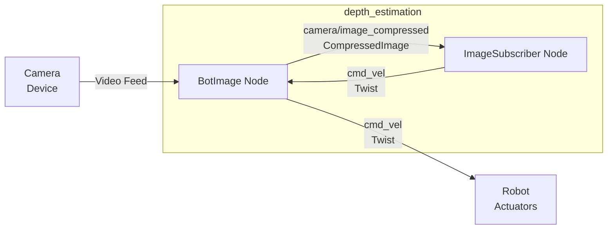

# DABOT_PROJECT

```mermaid
flowchart LR
    subgraph depth_estimation
        B[BotImage Node]
        I[ImageSubscriber Node]
    end

    CAM[Camera\nDevice]
    ROBOT[Robot\nActuators]

    CAM -->|Video Feed| B
    B -->|camera/image_compressed\nCompressedImage| I
    I -->|cmd_vel\nTwist| B
    B -->|cmd_vel\nTwist| ROBOT
```
